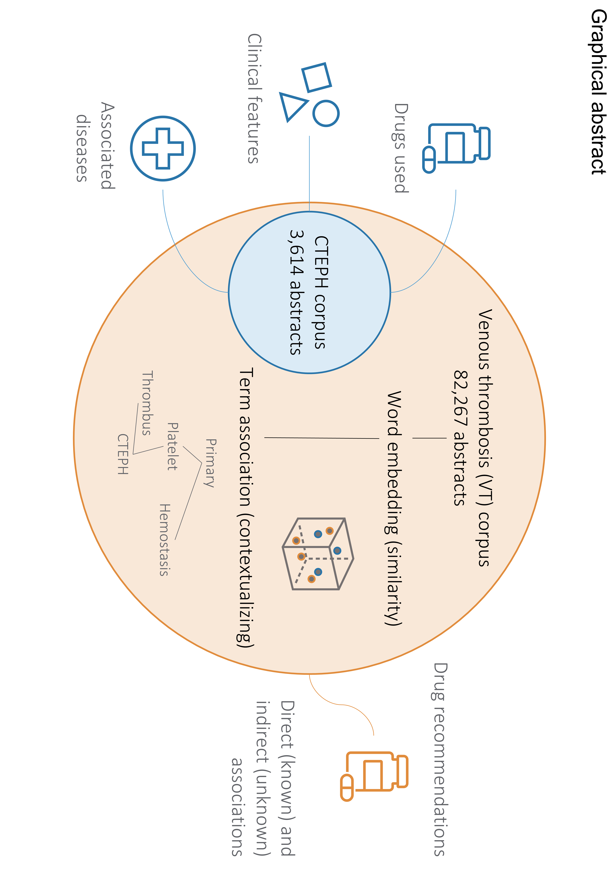

## Citing
"An exploration into CTEPH medications: Combining natural language processing, embedding learning, in vitro models, and real-world evidence for drug repurposing"
https://doi.org/10.1371/journal.pcbi.1012417 

## Introduction:
We tackled the challenge of keeping up with the ever-growing scientific literature. We focused on leveraging the power of natural language processing (NLP) to work through extensive literature data, targeting the discovery of new drug applications. Our tool, PubDigest, applies advanced NLP techniques and scans vast amounts of research abstracts from PubMed to uncover links between drugs and diseases. Our primary case study presents chronic thromboembolic pulmonary hypertension (CTEPH), a rare but life-threatening condition. Employing PubDigest, a notable discovery was the potential use of caplacizumab or benzofuran derivatives like amiodarone in treating CTEPH, suggested by their anti-thrombotic properties. However, we didn’t rely solely on computational analysis. Lab experiments, toxicity prediction, and clinical data were essential to validate these findings. While amiodarone showed promise in laboratory tests, real-world clinical data indicated increased mortality risks in CTEPH patients treated with it. This highlighted the crucial need to complement computational discoveries with practical, real-world evaluations. Our research shows the value of combining computational tools with traditional methods in medical research. This approach accelerates drug discovery and emphasizes a comprehensive view, especially for rare diseases. Through this work, we aim to contribute a novel, efficient pipeline for drug discovery that opens new doors in medical treatment and research.

## Adaption to your own work:
With the help of the jupyter notebooks, you can adapt this tool easily to your own disease/entity of interest.

## Installation & Setup:
### Example
Check Run_Example_Small.ipynb for full setup and usage.
For a more detailed installation continue below.

### Conda environment
 - conda env create -f environment.yml

### Download required Data
- Donwload USAN stems:
  - https://www.ama-assn.org/about/united-states-adopted-names/united-states-adopted-names-approved-stems
    - save the xlsx file at base_data, called USAN_Stems.xlsx
    - call python misc.prep_USAN()

- Download a list of cities with their coordinates
  - https://simplemaps.com/data/world-cities 
    - save the list to base_data as worldcities.csv
    - This might need curation to achive better results
      - Some additional help can be the mapping provided in Configs Location

## Running
### Example
Check Run_Example_Small.ipynb for full setup and usage

### Self-Setup
- check the configuration files in Configurations
  - add your Email Address in the PMC config. 
    - This Email is forwarded to the Administrators of the ENTREZ API.
  - Setup your Query config
  - Setup System config
  - Setup Workflow config
  - Setup Config_Main
    - Select here the desired configuations
  - Browse through the other configs if you desire to change them
- Run the program:
  - python main.py your_main_config.yml 

## Acknoledgments:

This Program makes use of the following packages:
+----------------------------------+------------------------------------------------------------------------+
|             Package              |                                License                                 |
+----------------------------------+------------------------------------------------------------------------+
|         aiofiles 22.1.0          |                               Apache-2.0                               |
|         aiosqlite 0.19.0         |                          (Licence not found)                           |
|           anyio 3.7.1            |                                  MIT                                   |
|        argon2-cffi 23.1.0        |                          (Licence not found)                           |
|   argon2-cffi-bindings 21.2.0    |                                  MIT                                   |
|           arrow 1.2.3            |                               Apache 2.0                               |
|           attrs 21.4.0           |                                  MIT                                   |
|           Babel 2.14.0           |                              BSD-3-Clause                              |
|          backcall 0.2.0          |                                UNKNOWN                                 |
|      beautifulsoup4 4.12.3       |                              MIT License                               |
|           bleach 6.0.0           |                        Apache Software License                         |
|         Bottleneck 1.3.5         |                             Simplified BSD                             |
|          brotlipy 0.7.0          |                                  MIT                                   |
|      cached-property 1.5.2       |                                  BSD                                   |
|        certifi 2022.12.7         |                                MPL-2.0                                 |
|           cffi 1.15.1            |                                  MIT                                   |
|     charset-normalizer 2.0.4     |                                  MIT                                   |
| chembl-webresource-client 0.10.7 |                        Apache Software License                         |
|           click 8.1.7            |                              BSD-3-Clause                              |
|          colorama 0.4.6          |                          (Licence not found)                           |
|       cryptography 39.0.1        |                (Apache-2.0 OR BSD-3-Clause) AND PSF-2.0                |
|          cycler 0.11.0           |                                  BSD                                   |
|          debugpy 1.7.0           |                                  MIT                                   |
|         decorator 5.1.1          |                            new BSD License                             |
|         defusedxml 0.7.1         |                                  PSFL                                  |
|          easydict 1.13           |                                LGPL-3.0                                |
|         entrypoints 0.4          |                          (Licence not found)                           |
|         et-xmlfile 1.1.0         |                                  MIT                                   |
|       exceptiongroup 1.2.1       |                          (Licence not found)                           |
|      fastjsonschema 2.20.0       |                                  BSD                                   |
|         flit-core 3.6.0          |                          (Licence not found)                           |
|            fqdn 1.5.1            |                                MPL 2.0                                 |
|           gensim 3.8.0           |                                LGPLv2.1                                |
|             idna 3.4             |                          (Licence not found)                           |
|     importlib-metadata 6.7.0     |                          (Licence not found)                           |
|    importlib-resources 5.12.0    |                          (Licence not found)                           |
|         ipykernel 6.16.2         |                           # Licensing terms                            |
|          ipython 7.34.0          |                                  BSD                                   |
|      ipython-genutils 0.2.0      |                                  BSD                                   |
|       isoduration 20.11.0        |                                UNKNOWN                                 |
|        itsdangerous 2.1.2        |                              BSD-3-Clause                              |
|           jedi 0.19.1            |                                  MIT                                   |
|           jinja2 3.1.4           |                          (Licence not found)                           |
|           joblib 1.1.1           |                                  BSD                                   |
|           json5 0.9.16           |                                 Apache                                 |
|        jsonpointer 3.0.0         |                          Modified BSD License                          |
|        jsonschema 4.17.3         |                                  MIT                                   |
|       jupyter-client 7.4.9       |                           # Licensing terms                            |
|       jupyter-core 4.12.0        |                     # The Jupyter licensing terms                      |
|       jupyter-events 0.6.3       |                           # Licensing terms                            |
|      jupyter-server 1.24.0       |                          (Licence not found)                           |
|   jupyter-server-fileid 0.9.2    |                          BSD 3-Clause License                          |
|    jupyter-server-ydoc 0.8.0     |                           # Licensing terms                            |
|        jupyter-ydoc 0.2.5        |                          BSD 3-Clause License                          |
|         jupyterlab 3.6.7         |                          (Licence not found)                           |
|    jupyterlab-pygments 0.2.2     |                                  BSD                                   |
|     jupyterlab-server 2.24.0     |         Copyright (c) 2015-2017, Project Jupyter Contributors          |
|         kiwisolver 1.4.4         |                       =========================                        |
|         MarkupSafe 2.1.5         |                              BSD-3-Clause                              |
|         matplotlib 3.3.1         |                                  PSF                                   |
|     matplotlib-inline 0.1.6      |                              BSD 3-Clause                              |
|          mistune 3.0.2           |                              BSD-3-Clause                              |
|          mkl-fft 1.3.1           |                                  BSD                                   |
|         mkl-random 1.2.2         |                                  BSD                                   |
|        mkl-service 2.4.0         |                                  BSD                                   |
|         nbclassic 1.1.0          |                              BSD-3-Clause                              |
|          nbclient 0.7.4          |                          BSD 3-Clause License                          |
|         nbconvert 7.6.0          |                          BSD 3-Clause License                          |
|          nbformat 5.8.0          |                          BSD 3-Clause License                          |
|        nest-asyncio 1.6.0        |                                  BSD                                   |
|             nltk 3.5             |                      Apache License, Version 2.0                       |
|          notebook 6.5.7          |                                  BSD                                   |
|       notebook-shim 0.2.4        |                          BSD 3-Clause License                          |
|          numexpr 2.8.4           |                                  MIT                                   |
|           numpy 1.19.2           |                                  BSD                                   |
|         openpyxl 3.0.10          |                                  MIT                                   |
|          packaging 22.0          |                          (Licence not found)                           |
|           pandas 1.3.4           |                              BSD-3-Clause                              |
|       pandocfilters 1.5.1        |                              BSD-3-Clause                              |
|           parso 0.8.4            |                                  MIT                                   |
|        pickleshare 0.7.5         |                                  MIT                                   |
|           Pillow 9.4.0           |                                  HPND                                  |
|            pip 22.3.1            |                                  MIT                                   |
|   pkgutil-resolve-name 1.3.10    |                          (Licence not found)                           |
|             ply 3.11             |                                  BSD                                   |
|        prettytable 3.7.0         |                             BSD (3 clause)                             |
|     prometheus-client 0.17.1     |                      Apache Software License 2.0                       |
|      prompt-toolkit 3.0.47       |                          (Licence not found)                           |
|           psutil 6.0.0           |                              BSD-3-Clause                              |
|          pycparser 2.21          |                                  BSD                                   |
|         pyenchant 3.2.2          |                                  LGPL                                  |
|         pygments 2.17.2          |                              BSD-2-Clause                              |
|           pymed 0.8.9            |                                  MIT                                   |
|         pyOpenSSL 23.0.0         |                      Apache License, Version 2.0                       |
|         pyparsing 3.0.9          |                          (Licence not found)                           |
|           PyQt5 5.15.7           |                                 GPL v3                                 |
|        PyQt5-sip 12.11.0         |                                  SIP                                   |
|        pyrsistent 0.19.3         |                                  MIT                                   |
|          PySocks 1.7.1           |                                  BSD                                   |
|      python-dateutil 2.8.2       |                              Dual License                              |
|     python-json-logger 2.0.7     |                                  BSD                                   |
|           pytz 2022.7            |                                  MIT                                   |
|           pywin32 306            |                                  PSF                                   |
|         pywinpty 2.0.10          |                                  MIT                                   |
|           PyYAML 6.0.1           |                                  MIT                                   |
|           pyzmq 26.0.3           |                          BSD 3-Clause License                          |
|         regex 2024.4.16          |                        Apache Software License                         |
|         requests 2.28.1          |                               Apache 2.0                               |
|       requests-cache 0.7.5       |                              BSD License                               |
|     rfc3339-validator 0.1.4      |                              MIT license                               |
|     rfc3986-validator 0.1.1      |                              MIT license                               |
|       scikit-learn 0.23.2        |                                new BSD                                 |
|           scipy 1.7.1            |                                  BSD                                   |
|          seaborn 0.11.0          |                             BSD (3-clause)                             |
|         Send2Trash 1.8.3         |                              BSD License                               |
|        setuptools 65.6.3         |                          (Licence not found)                           |
|            sip 6.6.2             |                                  SIP                                   |
|            six 1.16.0            |                                  MIT                                   |
|         smart-open 5.2.1         |                                  MIT                                   |
|          sniffio 1.3.1           |                           MIT OR Apache-2.0                            |
|         soupsieve 2.4.1          |                          (Licence not found)                           |
|         terminado 0.17.1         |      # terminado: A python websocket server backend for xterm.js       |
|       threadpoolctl 2.2.0        |                              BSD-3-Clause                              |
|          tinycss2 1.2.1          |                          (Licence not found)                           |
|           toml 0.10.2            |                                  MIT                                   |
|           tomli 2.0.1            |                          (Licence not found)                           |
|           tornado 6.2            |               http://www.apache.org/licenses/LICENSE-2.0               |
|           tqdm 4.66.4            |                            MPL-2.0 AND MIT                             |
|         traitlets 5.9.0          |                           # Licensing terms                            |
|     typing-extensions 4.4.0      |                          (Licence not found)                           |
|         Unidecode 1.3.8          |                                  GPL                                   |
|        uri-template 1.3.0        |                              MIT License                               |
|       url-normalize 1.4.3        |                                  MIT                                   |
|         urllib3 1.26.14          |                                  MIT                                   |
|          wcwidth 0.2.13          |                                  MIT                                   |
|          webcolors 1.13          |                              BSD-3-Clause                              |
|        webencodings 0.5.1        |                                  BSD                                   |
|      websocket-client 1.6.1      |                               Apache-2.0                               |
|           wheel 0.38.4           |                                  MIT                                   |
|       win-inet-pton 1.1.0        | This software released into the public domain. Anyone is free to copy, |
|         wincertstore 0.2         |                                  PSFL                                  |
|         wordcloud 1.9.3          |                              MIT License                               |
|            y-py 0.6.2            |                          (Licence not found)                           |
|       ypy-websocket 0.8.4        |                          (Licence not found)                           |
|           zipp 3.15.0            |                          (Licence not found)                           |
+----------------------------------+------------------------------------------------------------------------+

This tool is provided for educational and informational purposes only and does not constitute providing medical advice or professional services. The information provided should not be used for diagnosing or treating a health problem or disease, and those seeking personal medical advice should consult with a licensed physician. Always seek the advice of your doctor or other qualified health provider regarding a medical condition. Never disregard professional medical advice or delay in seeking it because of something you have read here or in any outputs of the tool. No physician-patient relationship is created by this tool or its use. Non of the contributors to this tool, make any representations, express or implied, with respect to the information provided herein or to its use. 
